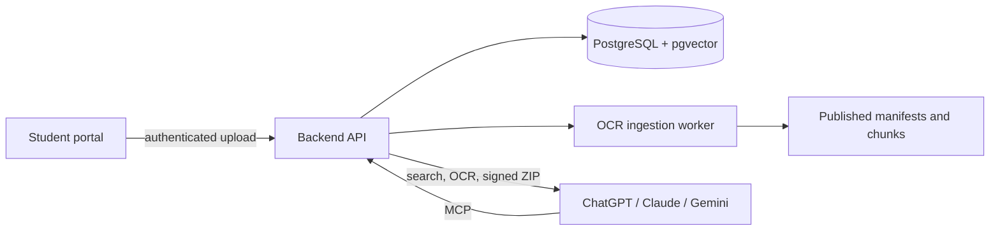

# MCP Docs Library

<p align="center">
  <strong>Open course materials directly from ChatGPT, Claude, Gemini, and other MCP clients.</strong><br />
  Search PYQs, notes, books, OCR text, and downloadable originals through one open-source library.
</p>

<p align="center">
  <a href="https://github.com/adarshpadhan/mcp-docs-library"></a>
  <a href="https://library.runloop.in/health"></a>
  
</p>

## Overview

MCP Docs Library is an open-source college learning platform with a TypeScript API, MCP server, PostgreSQL/pgvector search, Cloudflare delivery, and a local OCR ingestion worker. It is designed for licensed or permissioned course content and student access through compatible AI clients.



> **Status:** The public MCP endpoint is available for read/search testing. Authentication and student-domain authorization are not enabled yet; do not publish restricted material until those controls are deployed.

## Public MCP endpoint

```text
https://library.runloop.in/mcp
```

Health check: <https://library.runloop.in/health>

Available tools include `search_library`, `semantic_search`, `get_document_text`, `retrieve_context`, and `create_document_download_link`. Download links accept either one `documentId` or 1–20 `documentIds` and return a short-lived HTTPS ZIP URL.

## Architecture


## Deployment directories

- [`cloudflare/`](./cloudflare/) — student portal, Workers/Pages, and R2.
  The portal documentation includes the backend ingestion and storage paths.
- [`backend/`](./backend/) — backend deployment bundle containing the API/MCP server, PostgreSQL/pgvector, Redis, and
  indexing on the Oracle Ampere VM.
- [`local-ingest/`](./local-ingest/) — admin MacBook Air metadata and
  UnlimitedOCR processing package.

## Why files remain at the root

The root is the workspace control layer shared by all three deployments:

- `package.json` and `package-lock.json` manage dependencies, workspaces, and
  commands such as API, MCP, build, and local-ingest tasks.
- `tsconfig.json` and `tsconfig.base.json` coordinate TypeScript project
  references and shared compiler settings.
- `.env.example` documents shared local configuration; `.env` is local-only and
  is ignored by Git.
- `prettier.config.mjs` and `.gitignore` apply repository-wide tooling rules.
- `packages/` contains shared configuration and contracts used by Oracle and the
  MacBook worker.
- `infra/` contains database migrations shared by the Oracle deployment.
- `README.md` and `progress.md` document the project and implementation status.

The application-specific source is now separated under `cloudflare/`,
`backend/`, and `local-ingest/`. These root files should not be removed unless
the project is split into separate repositories.

## Current scaffold

- TypeScript project references and strict configuration.
- Fastify API with `/health`.
- MCP tools: `search_library`, `semantic_search`, `get_document_text`,
  `retrieve_context`, and `create_document_download_link`; the subjects resource
  `library://subjects`, backed by the local processed-manifest catalog.
- Streamable HTTP MCP endpoint at `POST /mcp`; supports session-based transport
  and fresh stateless POST requests from clients that do not preserve
  `Mcp-Session-Id`.
- Authentication is not currently enabled; OAuth discovery endpoints are intentionally absent until a complete OAuth broker is deployed
- Direct PDF downloads at `GET /api/v1/documents/:documentId/file`; administrators may use the bearer token, while MCP clients should call `create_document_download_link` with either one `documentId` or 1–20 `documentIds` to receive a 10-minute signed HTTPS ZIP URL
- Planned stable public hostname: `https://library.runloop.in` through a named Cloudflare Tunnel.
- Runnable stdio MCP entrypoint via `npm run mcp:stdio`.
- Versioned upload-job and OCR-manifest contracts.
- Local-ingest CLI that validates a page-preserving manifest shape and computes
  a source SHA-256 checksum.
- Initial PostgreSQL/pgvector schema migration for documents, pages, chunks,
  embeddings, and ingestion jobs.
- Docker Compose for PostgreSQL/pgvector and Redis.
- Oracle Docker Compose stack with the backend, PostgreSQL/pgvector, Redis, and
  the initial migration.

## Local setup

```sh
cp .env.example .env
npm install
npm run typecheck
npm run dev
```

The API listens on `http://127.0.0.1:8787` by default. During this ingestion
proof of concept, MCP reads generated packages from
`local-ingest/data/processed`. Set `MCP_INCLUDE_PENDING=false` in a
production-like environment to hide documents whose redistribution rights have
not been verified.

Apply the first database migration after starting PostgreSQL with:

```sh
psql "$DATABASE_URL" -f infra/migrations/001_initial.sql
```

To run the Oracle backend stack:

```sh
docker compose -f backend/docker-compose.yml up --build
```

With Podman Desktop, use the equivalent command:

```sh
podman compose -f backend/docker-compose.yml up -d --build
```

### Oracle VM Docker deployment

The backend has also been deployed to the configured Oracle VM at
`130.210.22.34` under `/home/ubuntu/mcp-college-library`. The remote stack is
managed with:

```sh
ssh 130.210.22.34
cd ~/mcp-college-library
sudo docker compose -f backend/docker-compose.yml ps
sudo docker compose -f backend/docker-compose.yml up -d --build
sudo docker compose -f backend/docker-compose.yml logs -f backend
sudo docker compose -f backend/docker-compose.yml down
```

The remote backend is currently verified locally on the VM at
`https://127.0.0.1:8787/mcp` using a self-signed certificate. The Oracle
cloud firewall and host firewall do not expose port 8787 publicly yet, and the
MCP endpoint has no production authentication. Do not open that port until a
real domain certificate, reverse proxy, and MCP/Google authorization are
configured.

Verify the running backend with:

```sh
curl http://127.0.0.1:8787/health
```

For local HTTPS testing, generate the self-signed certificate used by the
Podman stack:

```sh
mkdir -p backend/certs
openssl req -x509 -newkey rsa:2048 -sha256 -nodes -days 365 \
  -keyout backend/certs/localhost.key \
  -out backend/certs/localhost.crt \
  -subj "/CN=localhost" \
  -addext "subjectAltName=DNS:localhost,IP:127.0.0.1"
podman compose -f backend/docker-compose.yml up -d --build
curl -k https://127.0.0.1:8787/health
```

Use `https://127.0.0.1:8787/mcp` in a local MCP client. Because this
certificate is self-signed, the client must explicitly trust it or disable
certificate verification for local testing. Do not use this certificate for
the public Oracle deployment; terminate HTTPS with a real domain certificate
at a reverse proxy.

### Temporary Gemini development access

The local server is not reachable by Gemini's hosted app through
`127.0.0.1`. To create a temporary public HTTPS URL, start the backend first,
then run:

```sh
$HOME/.local/bin/cloudflared tunnel \
  --url https://127.0.0.1:8787 \
  --no-tls-verify
```

Cloudflare prints a temporary URL such as
`https://random-name.trycloudflare.com`. Add `/mcp` to that URL in Gemini:

```text
https://random-name.trycloudflare.com/mcp
```

### Development storage locations

The project and its large local assets are stored here:

- Repository: `/Users/adarsh/Projects/MCP-College Library`
- Apple Silicon OCR model and virtual environment:
  `local-ingest/vendor/unlimited-ocr-mac/` (about 7.2 GB)
- Generated manifests and page Markdown:
  `local-ingest/data/processed/` (small; generated and ignored by Git)
- Node dependencies: `node_modules/` (about 84 MB)
- Cloudflare tunnel binary: `/Users/adarsh/.local/bin/cloudflared`

When Podman Desktop is installed, it stores its Linux VM outside the repository:

```text
/Users/adarsh/.local/share/containers/podman/machine/libkrun/podman-machine-default-arm64.raw
```

The Podman VM was removed from this development machine after testing to
release its virtual disk space. The source repository and OCR model are
independent of Podman and were preserved.
Inspect usage with:

```sh
podman system df -v
podman machine list
```

### GitHub publishing and document storage

Do not commit PDFs, OCR output, API credentials, certificates, model weights, or
Python environments to a public GitHub repository. The current `.gitignore`
excludes `local-ingest/data/`, certificates, dependencies, and OCR model/runtime
assets.

Recommended layout:

- **Public GitHub repository:** TypeScript source, migrations, contracts,
  ingestion scripts, sanitized example manifests, and documentation.
- **Private object storage:** Original PDFs and processed OCR packages. Use a
  private Cloudflare R2 bucket, Oracle Object Storage bucket, or an encrypted
  server directory. Keep only the document ID and metadata in PostgreSQL.
- **PostgreSQL:** Document metadata, license status, page text/chunks, and
  embeddings. Back up with encrypted `pg_dump` files outside GitHub.
- **Local machine:** OCR models and temporary ingestion inputs. These can be
  regenerated or downloaded and should remain ignored.
- **Git LFS:** Use only if a repository must version large, redistributable
  assets and the license explicitly permits public redistribution. It is not a
  substitute for private access control.

Current development locations:

- Original PDF on the server:
  `/home/ubuntu/mcp-college-library/local-ingest/data/raw/<document-id>/`
- Processed manifest and page Markdown on the server:
  `/home/ubuntu/mcp-college-library/local-ingest/data/processed/<document-id>/`
- Local source PDF/OCR package:
  `local-ingest/data/` (ignored by Git)

Before publishing a document, confirm its raw and processed licenses allow
public redistribution. For restricted material, publish only metadata and
serve the PDF through an authenticated backend or private object-storage URL.

When no containers from any project need to be preserved, reclaim unused
Podman images and volumes with the interactive commands below. Review the
output before confirming; these commands can affect other Podman projects:

```sh
podman image prune -a
podman volume prune
```

The application stack itself can be stopped without deleting the source or
OCR model:

```sh
podman compose -f backend/docker-compose.yml down
```

macOS may also report browser/application caches and APFS snapshots as
“System Data”. Inspect those separately rather than deleting files inside
`/System` or `/private/var` manually.

Keep the tunnel terminal open while testing. Stop it with `Ctrl-C`, then stop
the local stack:

```sh
podman compose -f backend/docker-compose.yml down
```

Quick tunnels are unauthenticated and expose the current test catalog to
anyone who has the URL. Use them only for short development tests; the URL
changes when the tunnel is stopped.

Authentication is intentionally not enabled in this local backend smoke-test
stage. Google OIDC, manifest persistence in PostgreSQL, and production
authorization are still pending.

Run the local ingestion contract check with:

```sh
npm run dev:ingest -- /path/to/permitted-document.pdf
```

Only ingest files whose raw and processed licenses permit the intended
redistribution. See [progress.md](./progress.md) for the architecture,
deployment, licensing, and implementation roadmap.
